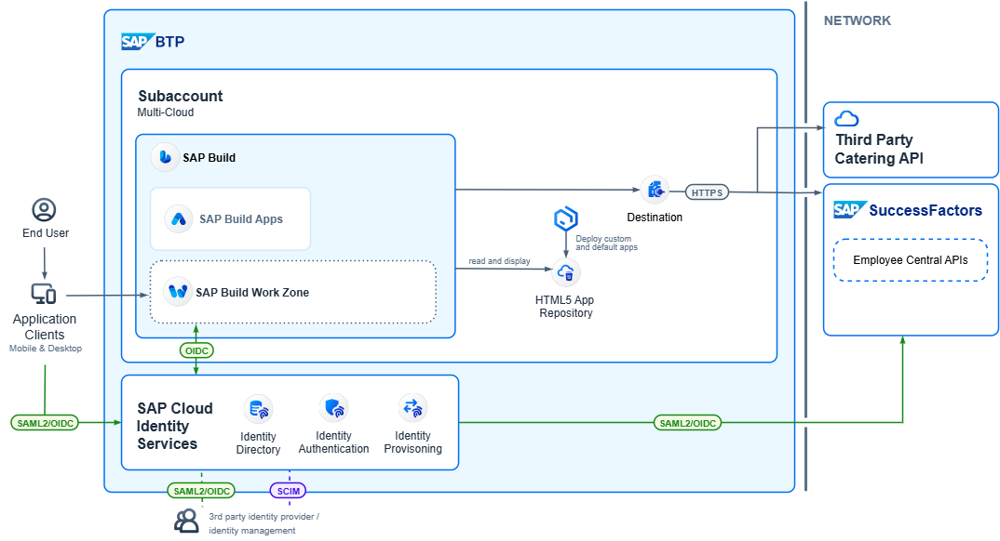

# HCM with SAP Build

## Description

This mission is based on this [Interactive Value Journey](https://ivj-vx.cfapps.eu10.hana.ondemand.com/journey/9aa7c281-29e1-4869-80bf-45965fc92f8f/intro).

This demo illustrates how HRIS teams can easily build extensions to SAP SuccessFactors HCM solutions to address HR business needs.

With SAP BTP, HRIS can create apps and tools without having to utilize external development resources or be experts in writing code. You'll see how an HRIS team can use SAP Build, part of the SAP BTP portfolio, to create a customized application that connects SAP SuccessFactors Employee Central data and a third-party application that allows employees to order lunch in the office.

## Business Scenario

**ACTING PERSONAS**:
- **Neil Flores**
  HR Business Partner, Americas
  *What drives value for Neil Flores?*
- **Barry Best**
  HRIS Specialist
  *What drives value for Barry Best?*

**VALUE DRIVERS**
* **Improve utilization of employee benefits**
  by making it easier for employees to have awareness of their benefits
* **Improve utilization of facilities**
  by encouraging employees to come into the office with benefits specifically tailored for their in-office needs
* **Improve employee experience**
  by making it easier for employees to find the information they need without having to ask for help
* **Empower HRIS to create apps and tools without Enterprise IT assistance**
  by providing easy to use and easy to learn development tools

### Neil Flores
> My goal is to improve the employee experience and make it easy for them to utilize the resources and benefits available to when they come into the office while reducing impact on helpdesk and facilities when they come into the office. For example, this office has no cafeteria, so they can have food delivered via specific vendors.

**Needs**
- Increase utilization of company-provided benefits, helping employees take advantage of the benefits we’ve negotiated for them
- Improve access to important information that helps employees navigate when visiting offices
- Reduce dependency on in-office HR and facilities staff to answer questions

**Challenges**:
- Local HR and IT staff are under-resourced, and have limited availability due to frequent requests for assistance from employees unfamiliar with the office
- Office facilities are under-utilized: offices are idle/unoccupied
- Employee Benefits are underutilized: current food voucher redemption is cumbersome and there is little adoption of it
- Employee experience and sentiment is low

**Benefits**:
- Improve operational efficiency of in-office staff
- Improve utilization of office facilities
- Improve employee experience
- Improve utilization of employee benefits

### Barry Best

> My goal is to help the HR business partners achieve their goals and enable our local facilities and IT staff resolve employee problems quickly and efficiently.

**Needs**:
- HRIS need easy-to-use and easy-to-learn tools, we aren’t expert developers
- Leverage existing enterprise systems and architecture to reduce costs
- Need to be able to do the app in-house with existing resources

**Challenges**:
- Regional HRIS staff are not expert developers or have limited development skills
- Regional enterprise IT staff don’t have time or resources to do one-off projects for regional needs
- Prior food ordering process was too difficult based on employee feedback

**Benefits**:
- Easier ability to create apps and tools without professional development skills
- More cost effective to create apps and tools leveraging enterprise IT's existing SAP BTP infrastructure
- Faster ability to address business needs of regional HR

## Mission Content:

### Discovery and prerequisites

1. [Discover SAP Build](./discover/sap-build.md)
2. [Success Factors Prerequisites](./prerequisites/sf.md)

### Setup SAP BTP Subaccount

1. [Subaccount Setup](./btp/setup.md)
2. [Integration setup for Success Factors](./btp/destinations-sf.md)
3. [Integration setup for 3rd Party Food Provider](./btp/destinations-catering.md)

### Creating application in SAP Build Apps

1. [Import template](./app/create-project.md)
2. [Adding integrations to the app](./app/integration.md)
3. [Creating a page with the employee benefits](./app/page-benefits.md)
4. [Creating a page with meals](./app/page-meals.md)
5. [Update main page](./app/main-page.md)
6. [Preview Application](./app/preview.md)

## Known Issues

No known issues.

## How to obtain support

[Create an issue](https://github.com/SAP-samples/build-apps-hcm-sf-mobile-app/issues) in this repository if you find a bug or have questions about the content.
 
For additional support, [ask a question in SAP Community](https://answers.sap.com/questions/ask.html).

## Contributing
If you wish to contribute code, offer fixes or improvements, please send a pull request. Due to legal reasons, contributors will be asked to accept a DCO when they create the first pull request to this project. This happens in an automated fashion during the submission process. SAP uses [the standard DCO text of the Linux Foundation](https://developercertificate.org/).

## License
Copyright (c) 2025 SAP SE or an SAP affiliate company. All rights reserved. This project is licensed under the Apache Software License, version 2.0 except as noted otherwise in the [LICENSE](LICENSE) file.